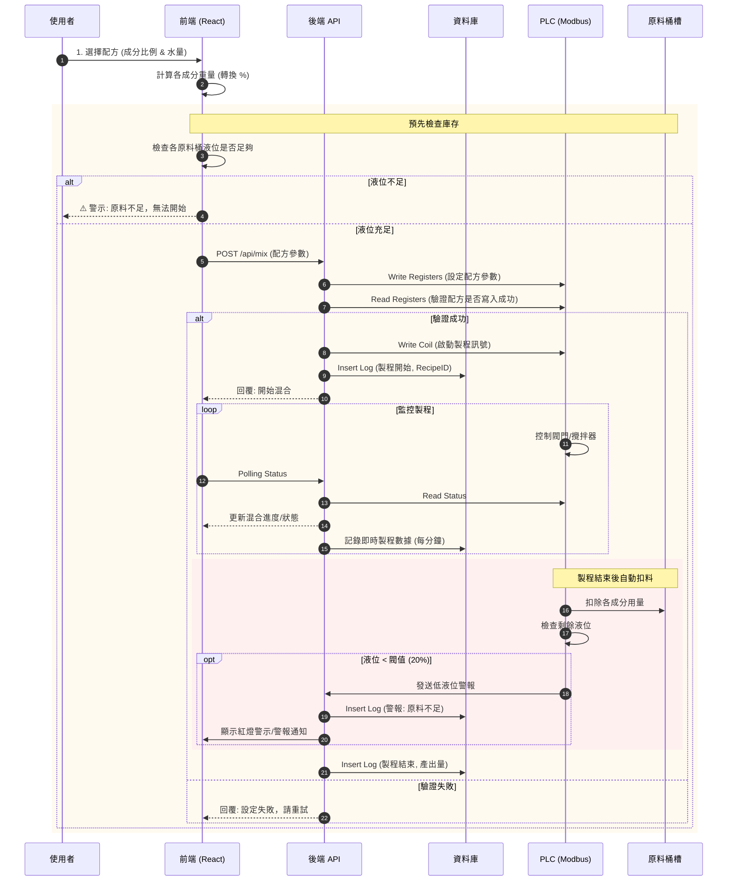
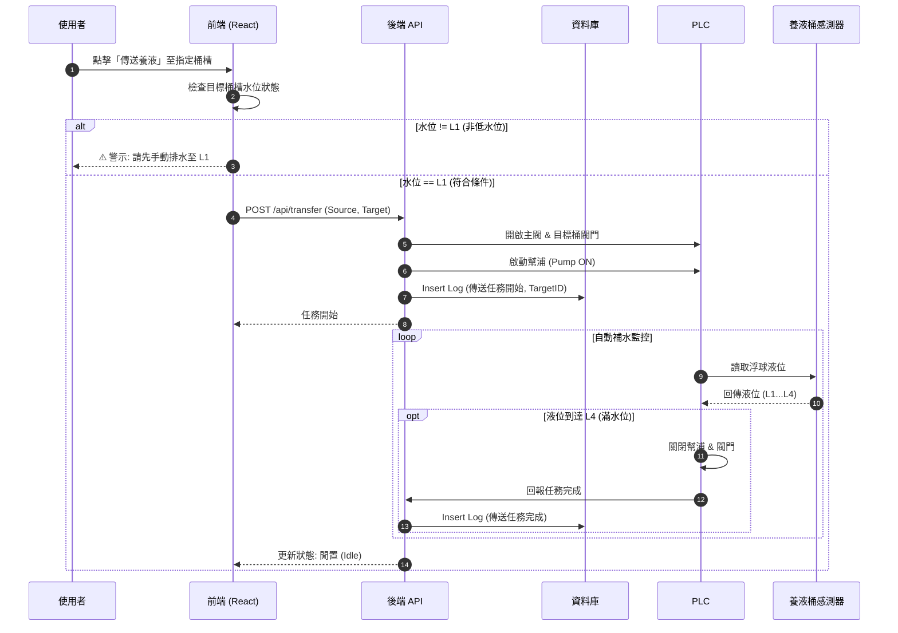
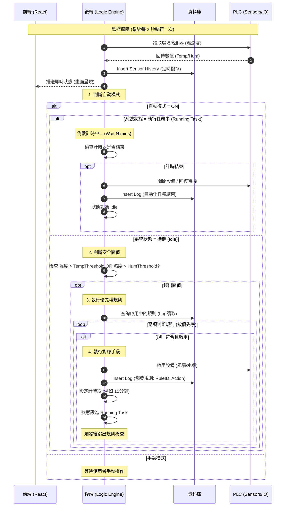

🌿 Greenhouse OS - Web SCADA System

Greenhouse OS 是一個現代化的網頁版 SCADA 系統，專為智慧溫室管理設計。結合即時數據監控、互動式 3D 視覺化以及自動化設備控制。

🎮 自動化控制流程 (Automation Scenarios)

以下圖表描述了系統的三大核心自動化邏輯。這些流程涵蓋了使用者操作、前端驗證、後端處理、PLC 控制以及資料庫記錄。

一、調配桶混合流程 (Mixing Process)

情境描述：
此流程負責根據使用者選擇的配方，控制 PLC 進行精準的原料混合。

使用者在前端選擇配方，並輸入目標水量。

前端預檢：系統自動計算所需各原料重量，並比對當前原料桶存量。若任一原料不足，直接在前端阻擋並警示，不發送請求。

後端處理：若庫存充足，前端發送請求至後端。後端將參數寫入 PLC 並驗證。

製程執行：PLC 啟動混合設備（閥門/攪拌器）。後端定期輪詢 PLC 狀態並寫入資料庫（即時數據）。

扣料與警報：製程結束後，系統自動扣除原料桶帳面庫存。若更新後的庫存低於安全閥值 (20%)，系統會觸發低水位警報並記錄。

二、調配桶傳送至養液桶 (Transfer Logic)

情境描述：
此流程負責將調配好的養液傳送至指定的層架養液桶（Rack Tank）。

使用者點擊「傳送養液」按鈕。

前端防呆：檢查目標養液桶的當前水位。若水位非低位 (L1)，則視為還有殘留液體，禁止自動補水以防溢出，並提示使用者手動排水。

任務啟動：若條件符合，後端發送指令給 PLC，開啟主閥、目標閥並啟動幫浦。

自動補水：PLC 監控目標桶的浮球液位。當液位到達滿水位 (L4) 時，PLC 自動關閉幫浦與閥門，並回報任務完成。

三、環境控制自動化 (Environmental Control)

情境描述：
系統全天候監控溫室環境，並根據設定的邏輯自動調節設備。

監控迴圈：後端定期讀取感測器數值，並寫入資料庫作為歷史紀錄。

模式判斷：檢查系統是否處於「自動模式 (AUTO)」。若為手動模式則不介入。

閥值檢查：若在自動模式且系統閒置，檢查溫度或濕度是否超出設定的安全閥值。

規則執行：若超出閥值，系統根據優先權查詢啟用的規則。若找到符合的規則，則執行對應動作（如開啟風扇）。

任務計時：設備啟動後會進入「任務執行中」狀態並倒數計時（例如 15 分鐘）。在此期間系統不會重複觸發規則。

任務結束：倒數結束後，系統自動關閉設備，寫入任務結束紀錄，並回到待機監控狀態。

🧪 功能測試指南 (Testing Guide)

由於系統邏輯較為複雜，前端已實作對應的按鈕與設定介面供測試使用：

測試「混合流程」:

    進入 配方管理 (Formulas) 頁面。

    在任意配方卡片上點擊 「Start Mix」 按鈕。

    觀察 3D 視圖中的主調配桶 (Mixer) 狀態變為 Mixing，進度條開始跑動，完成後會自動扣除原料桶液位。

測試「傳送/補水流程」:

    進入 3D 監控 (Monitor) 或 Dashboard。

    點擊任意 層架 (Rack) 或其養液桶。

    在右側彈出的詳細資訊面板中，若水位為 L1，會顯示 「Start Refill」 按鈕。

    點擊後，觀察 3D 視圖中的管線變色，且目標桶水位逐漸上升至 L4。

測試「環境控制」:

    進入 自動化邏輯 (Automation Logic) 頁面。

    調整 「溫度閥值」 或新增的 「濕度閥值」。

    確保系統處於 AUTO 模式。

    若模擬數據超出設定值，Dashboard 上的風扇會自動開啟，並進入倒數計時狀態。

🚀 Getting Started

Follow these steps to set up the project locally.

Prerequisites

Node.js (v16 or higher)

npm or yarn

Installation

Clone the repository

git clone [https://github.com/rocklon0526/greenhouse_scada.git](https://github.com/rocklon0526/greenhouse_scada.git)
cd greenhouse_scada

Install dependencies

npm install

Run Development Server

npm run dev

Open http://localhost:5173 to view it in the browser.