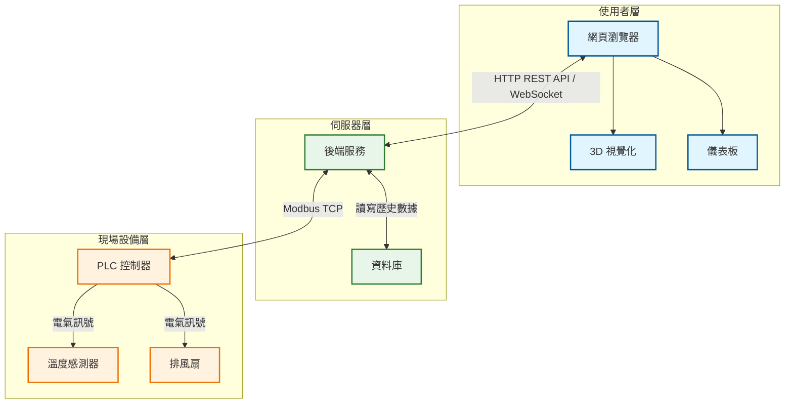
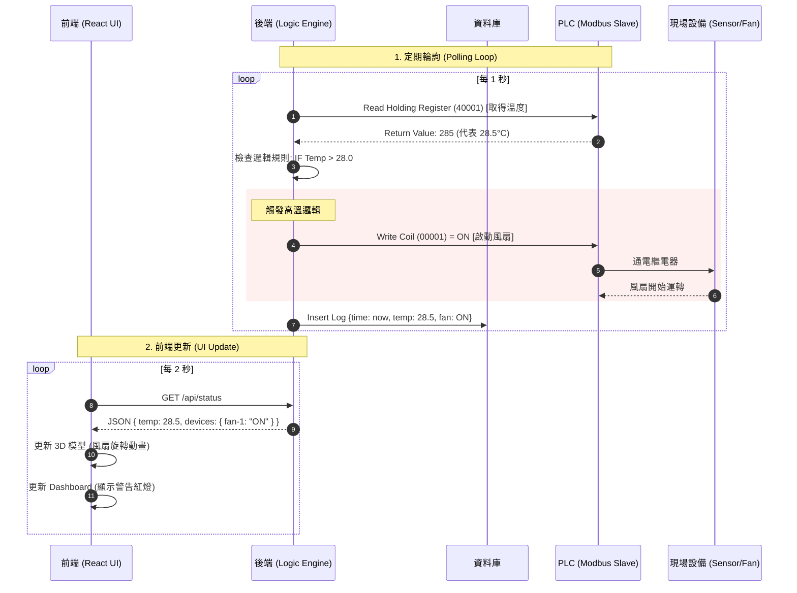

# 🌿 Greenhouse OS - Web SCADA System


**Greenhouse OS** is a modern, web-based SCADA (Supervisory Control and Data Acquisition) system designed for intelligent greenhouse management. It combines real-time data monitoring, interactive 3D visualization, and automated device control into a seamless user interface.

> Built with React, Three.js (Fiber), and TypeScript.

## ✨ Key Features

* **🖥️ Interactive 3D Visualization**:
    * Full 3D representation of the greenhouse layout using `React Three Fiber`.
    * Visual status indicators for Vertical Racks, Sensor Groups (Top/Mid/Bot), and Infrastructure.
    * Interactive elements: Click on sensors or devices to view details.

* **QC Real-time Monitoring**:
    * Visualizes Temperature, Humidity, and CO2 levels across different vertical levels (Z-axis).
    * Integrated **Weather Station** panel for outdoor conditions (UV, Temp, Humidity).
    * Historical data trending charts on the dashboard.

* **QC Device Control**:
    * **Manual/Auto Modes**: Toggle system-wide automation.
    * **Equipment Control**: Manage Water Walls, Exhaust Fans, and AC Units.
    * Configurable parameters (ejp. Fan Speed, Water Level, Target Temperature).

* **⚙️ Automation Logic Builder**:
    * **No-Code Rule Engine**: Create custom logic rules (e.g., "IF Indoor Temp > 28°C THEN Turn ON Fans").
    * Support for AND/OR logic conditions.
    * Priority-based execution.

* **🎨 Responsive & Modern UI**:
    * Dark mode aesthetic utilizing Tailwind CSS.
    * Glassmorphism design elements.
    * Fully responsive layout for desktop and tablet monitoring.

## 🛠️ Tech Stack

* **Core**: React 18, TypeScript, Vite
* **Styling**: Tailwind CSS, Lucide React (Icons)
* **State Management**: Zustand
* **3D Graphics**: @react-three/fiber, @react-three/drei, Three.js
* **Routing**: React Router DOM

## 🚀 Getting Started

Follow these steps to set up the project locally.

### Prerequisites

* Node.js (v16 or higher)
* npm or yarn

### Installation

1.  **Clone the repository**
    ```bash
    git clone [https://github.com/rocklon0526/greenhouse_scada.git](https://github.com/rocklon0526/greenhouse_scada.git)
    cd greenhouse_scada
    ```

2.  **Install dependencies**
    ```bash
    npm install
    # or
    yarn install
    ```

3.  **Configure Environment**
    Create a `.env` file in the root directory (optional if using defaults):
    ```env
    VITE_API_URL=http://localhost:8088/system/webdev/ai_env_control/scada_api
    VITE_USE_MOCK=true
    ```
    *Set `VITE_USE_MOCK=true` to run without a backend server.*

4.  **Run Development Server**
    ```bash
    npm run dev
    ```
    Open [http://localhost:5173](http://localhost:5173) to view it in the browser.

## ws Project Structure

```text
src/
├── components/
│   ├── 3d/            # Three.js components (VerticalRack, Fan3D, etc.)
│   ├── devices/       # Device control modals
│   ├── logic/         # Rule builder components
│   └── ui/            # Reusable UI cards/buttons
├── configs/
│   ├── constants.ts   # App-wide constants
│   └── layoutConfig.ts # Warehouse layout & 3D coordinates definition
├── mocks/             # Mock data generators for demo mode
├── pages/
│   ├── OverviewPage.tsx  # Main 3D Scene
│   ├── DashboardPage.tsx # 2D Data & Charts
│   └── LogicPage.tsx     # Automation Logic Builder
├── services/          # API integration
├── stores/            # Global state (Zustand)
└── types/             # TypeScript interfaces
```

SCADA 系統架構與控制流程圖

本文檔包含兩張圖表，旨在說明智慧溫室 SCADA 系統的整體架構以及「高溫自動排風」的控制邏輯流程。

1. 系統架構圖 (System Architecture)

此圖表展示了系統中各個層級（使用者層、伺服器層、設備層）之間的連接關係與通訊協定。


2. 高溫自動排風控制時序圖 (High Temp Auto-Ventilation Sequence)

此時序圖詳細描述了當溫室溫度超過設定值（例如 28°C）時，系統如何自動偵測並觸發排風扇的動作流程。

