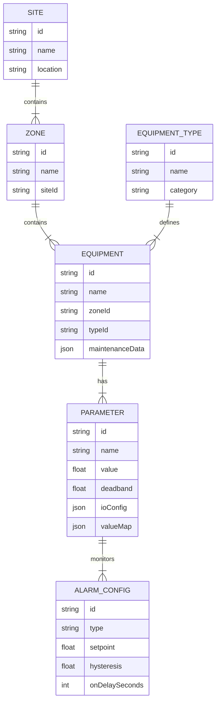

# Modern SCADA Data Modeling Framework for Greenhouse Automation

## 1. Entity-Relationship Concept

The system is structured hierarchically to ensure scalability and logical organization. This structure allows for efficient data aggregation, alarm propagation, and navigation.

### Hierarchy Levels
1.  **Site (場域)**: The root level entity. Represents a physical location (e.g., "Taichung Greenhouse Complex"). Contains global settings and aggregates data from all Zones.
2.  **Zone (區域)**: A logical subdivision within a Site (e.g., "Planting Zone A", "Nursery", "Water Treatment Room"). Zones group related Equipment and often define environmental boundaries (e.g., a Zone has its own target temperature).
3.  **Equipment (設備)**: The physical asset (e.g., "Fan #1", "Pump A"). This is the primary object for control and monitoring. It is an instance of an **Equipment Type**.
4.  **Equipment Type (設備類型)**: A template or class definition (e.g., "VariableSpeedFan", "OnOFFValve"). It defines the standard Parameters, Alarms, and Control Logic applicable to all instances of this type.

### Relationships
-   **One-to-Many**: A Site has multiple Zones. A Zone has multiple Equipment.
-   **Inheritance**: Equipment inherits its base definition from Equipment Type but can override specific configurations (e.g., specific alarm thresholds).



---

## 2. JSON Data Schema / Interface Definition (TypeScript)

This schema defines the structure for Equipment, Parameters, and Alarms, specifically addressing the requirements for Deadband, On-Delay, Maintenance tracking, **I/O Mapping**, **Enum Mapping**, and **Alarm Hysteresis**.

### Core Interfaces

```typescript
// --- Enums & Types ---

export type Severity = 'Critical' | 'Warning' | 'Info';
export type DataType = 'boolean' | 'number' | 'string';
export type AlarmType = 'HiHi' | 'Hi' | 'Lo' | 'LoLo' | 'Digital_True' | 'Digital_False';
export type Protocol = 'ModbusTCP' | 'OPCUA' | 'MQTT';
export type AlarmStatus = 'Active_Unacked' | 'Active_Acked' | 'Cleared_Unacked' | 'Cleared_Acked';

// --- Parameter (Tag) Definition ---

export interface ParameterConfig {
  id: string;             // Unique Tag ID (e.g., "speed_pv")
  name: string;           // Human readable name (e.g., "Current Speed")
  dataType: DataType;
  unit?: string;          // e.g., "°C", "%", "RPM"
  
  // -- I/O Mapping (Physical Layer) --
  ioConfig?: {
    protocol: Protocol;
    address: string;      // e.g., "40001" or "NS=2;s=FanSpeed"
    readWriteMode: 'R' | 'W' | 'RW';
  };

  // -- Scaling (Analog) --
  // Raw (PLC) -> Engineering (UI)
  scaling?: {
    rawMin: number;       // e.g., 0
    rawMax: number;       // e.g., 65535
    engMin: number;       // e.g., 0
    engMax: number;       // e.g., 100.0
  };

  // -- Value Mapping (Discrete/Enum) --
  // Maps raw values (0, 1, 2) to human-readable strings ("Off", "Running", "Fault")
  valueMap?: Record<number | string, string>;
  
  // -- Data Processing --
  deadband?: number;      // Absolute value change required to log/emit event
                          // NOTE: Compared against 'lastLoggedValue' to prevent drift.
  
  scanRateMs?: number;    // Polling interval if applicable
  isReadOnly: boolean;    // True for sensors, False for setpoints/actuators
}

// --- Alarm Configuration ---

export interface AlarmRule {
  id: string;
  type: AlarmType;        // The condition type
  setpoint: number;       // The threshold value
  severity: Severity;
  
  // -- Time Logic --
  onDelaySeconds: number; // Time condition must persist before triggering
  
  // -- Stability Logic --
  // Must drop below (setpoint - hysteresis) to clear (for Hi alarms)
  // Prevents chattering at the threshold.
  hysteresis?: number;

  message: string;        // e.g., "High Temperature Warning"
  enabled: boolean;
}

// --- Runtime Alarm State (ISA-18.2 Lifecycle) ---

export interface ActiveAlarmState {
  ruleId: string;
  triggerTime: number;    // Timestamp when condition was met (post-delay)
  ackTime?: number;       // Timestamp when operator acknowledged
  ackUser?: string;       // User who acknowledged
  clearTime?: number;     // Timestamp when condition cleared
  valueAtTrigger: number; // Snapshot of value
  status: AlarmStatus;
}

// --- Maintenance Tracking ---

export interface MaintenanceStats {
  totalRuntimeHours: number; // Accumulated runtime
  cycleCount: number;        // Number of ON/OFF cycles
  lastMaintenanceDate: string; // ISO Date
  nextMaintenanceDueHours?: number; // Alert when runtime > this
}

// --- Equipment Model ---

export interface Equipment {
  id: string;
  name: string;
  typeId: string;         // Reference to Equipment Type
  zoneId: string;         // Logical location
  
  // Configuration
  parameters: Record<string, ParameterConfig>;
  alarms: Record<string, AlarmRule[]>; // Keyed by parameterId
  
  // Runtime State (The "Live" Data)
  // NOTE: For React/Redux, it is recommended to flatten this structure.
  state: {
    [parameterId: string]: {
      value: any;
      timestamp: number;
      quality: 'Good' | 'Bad';
    };
  };

  // Active Alarms
  activeAlarms: ActiveAlarmState[];

  // Maintenance
  maintenance: MaintenanceStats;
}
```

---

## 3. Example Instance: Ventilation Fan

Here is a concrete example of a **Variable Speed Exhaust Fan** represented in this schema.

### Scenario
-   **Equipment**: Exhaust Fan 01 (Zone A)
-   **Parameters**:
    -   `speed_pv` (Process Value): Current speed (RPM). **Deadband: 10 RPM**. Modbus 40001.
    -   `speed_sp` (Setpoint): Target speed (RPM). Modbus 40002.
    -   `status`: Running status (Enum). Modbus 10001. 0=Off, 1=Running, 2=Fault.
    -   `vibration`: Vibration sensor (mm/s). Modbus 30005. Scaled 0-32767 -> 0-10.0.
-   **Alarms**:
    -   **High Vibration**: Critical if > 5.0 mm/s for **5 seconds**. Hysteresis 0.5 mm/s (Clears at 4.5).

### JSON Representation

```json
{
  "id": "fan_01_zone_a",
  "name": "Exhaust Fan 01",
  "typeId": "var_speed_fan",
  "zoneId": "zone_a",
  "maintenance": {
    "totalRuntimeHours": 1250.5,
    "cycleCount": 340,
    "lastMaintenanceDate": "2023-10-01T00:00:00Z",
    "nextMaintenanceDueHours": 2000
  },
  "parameters": {
    "speed_pv": {
      "id": "speed_pv",
      "name": "Current Speed",
      "dataType": "number",
      "unit": "RPM",
      "ioConfig": {
        "protocol": "ModbusTCP",
        "address": "40001",
        "readWriteMode": "R"
      },
      "deadband": 10,
      "isReadOnly": true
    },
    "speed_sp": {
      "id": "speed_sp",
      "name": "Target Speed",
      "dataType": "number",
      "unit": "RPM",
      "ioConfig": {
        "protocol": "ModbusTCP",
        "address": "40002",
        "readWriteMode": "RW"
      },
      "deadband": 0,
      "isReadOnly": false
    },
    "status": {
      "id": "status",
      "name": "Running Status",
      "dataType": "number",
      "ioConfig": {
        "protocol": "ModbusTCP",
        "address": "10001",
        "readWriteMode": "R"
      },
      "valueMap": {
        "0": "Off",
        "1": "Running",
        "2": "Fault"
      },
      "isReadOnly": true
    },
    "vibration": {
      "id": "vibration",
      "name": "Vibration Level",
      "dataType": "number",
      "unit": "mm/s",
      "ioConfig": {
        "protocol": "ModbusTCP",
        "address": "30005",
        "readWriteMode": "R"
      },
      "scaling": {
        "rawMin": 0,
        "rawMax": 32767,
        "engMin": 0,
        "engMax": 10.0
      },
      "deadband": 0.1,
      "isReadOnly": true
    }
  },
  "alarms": {
    "vibration": [
      {
        "id": "alm_vib_hihi",
        "type": "HiHi",
        "setpoint": 5.0,
        "hysteresis": 0.5,
        "severity": "Critical",
        "onDelaySeconds": 5,
        "message": "CRITICAL: High Vibration Detected",
        "enabled": true
      }
    ]
  },
  "state": {
    "speed_pv": { "value": 1205, "timestamp": 1701435600000, "quality": "Good" },
    "vibration": { "value": 0.5, "timestamp": 1701435600000, "quality": "Good" },
    "status": { "value": 1, "timestamp": 1701435600000, "quality": "Good" }
  },
  "activeAlarms": []
}
```

## 4. Implementation Logic Notes

### Deadband Logic (Anchor Logic)

To prevent "creeping" or drift where slow changes are never logged, we compare against the **Last Logged Value**, not the last polled value.

```python
# Python Logic (Backend)
def should_update_value(last_logged_val, current_raw_val, deadband):
    # Always log the first value
    if last_logged_val is None:
        return True
    
    delta = abs(current_raw_val - last_logged_val)
    
    # Only update anchor if change exceeds deadband
    if delta > deadband:
        return True
    
    return False
```

### Alarm On-Delay Logic
```typescript
const activeAlarms = new Map<string, number>(); // Map<AlarmID, StartTimestamp>

function checkAlarm(val: number, rule: AlarmRule) {
    const isConditionMet = val > rule.setpoint;

    if (isConditionMet) {
        if (!activeAlarms.has(rule.id)) {
            // Condition just started, start timer
            activeAlarms.set(rule.id, Date.now());
        } else {
            // Condition persists, check duration
            const duration = (Date.now() - activeAlarms.get(rule.id)) / 1000;
            if (duration >= rule.onDelaySeconds) {
                triggerAlarm(rule); // Create ActiveAlarmState entry
            }
        }
    } else {
        // Condition cleared
        if (activeAlarms.has(rule.id)) {
            activeAlarms.delete(rule.id);
            // If alarm was active, transition to Cleared state (don't just delete)
            clearAlarm(rule); 
        }
    }
}
```
