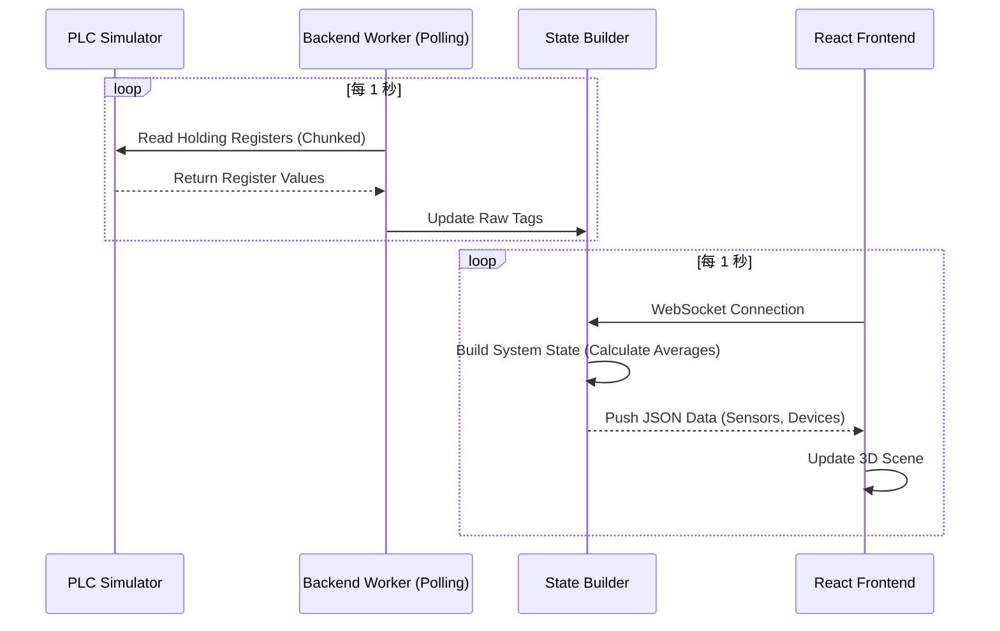
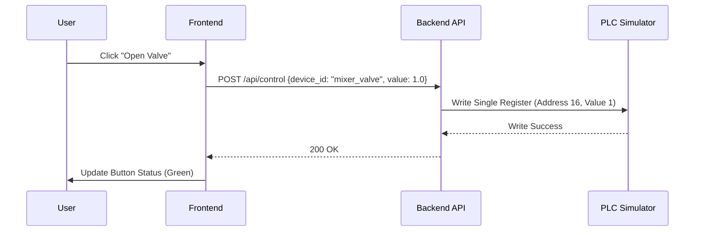

# 系統規格書 (System Specification)

## 1. 專案結構說明

本系統分為三個主要目錄：`frontend` (前端), `backend` (後端), `simulator` (模擬器)。

### 1.1 目錄結構樹

```
modern_scada/
├── backend/                # 後端服務 (Python/FastAPI)
│   ├── app/
│   │   ├── routers/        # API 路由定義 (api.py, auth.py, frontend.py)
│   │   ├── services/       # 業務邏輯 (state_builder.py: 構建系統狀態)
│   │   ├── workers/        # 背景工作 (polling.py: Modbus 輪詢)
│   │   └── main.py         # 程式進入點
│   ├── config.yaml         # 系統設定檔 (Modbus 地址、Tag 定義)
│   ├── verify_api.py       # API 驗證腳本
│   └── tests/              # 測試腳本 (e2e_test.py)
├── frontend/               # 前端應用 (React/Vite)
│   ├── src/
│   │   ├── components/3d/  # 3D 元件 (SensorGroup.tsx, Mixer.tsx 等)
│   │   ├── pages/          # 頁面元件 (OverviewPage.tsx, LoginPage.tsx)
│   │   ├── stores/         # 狀態管理 (useAppStore.ts - Zustand)
│   │   └── services/       # API 服務 (api.ts)
│   └── vite.config.ts      # Vite 設定 (包含 Proxy)
├── simulator/              # PLC 模擬器
│   └── main.py             # Modbus TCP Server 邏輯
└── docker-compose.yml      # 容器編排設定
```

## 2. 核心邏輯與資料流

### 2.1 資料採集流程 (Data Acquisition)

系統透過 Modbus TCP 協議從 PLC (或模擬器) 採集數據，並透過 WebSocket 推播至前端。



### 2.2 設備控制流程 (Device Control)

使用者在前端操作設備（如開關閥門），指令經由 API 傳送至後端，再寫入 PLC。



## 3. 詳細模組說明

### 3.1 Backend
*   **`workers/polling.py`**: 核心輪詢引擎。
    *   **邏輯**: 讀取 `config.yaml` 中的 tags 設定，將連續的地址分組 (Chunking)，避免超過 Modbus TCP 單次讀取限制 (125 registers)。
    *   **優化**: 使用 `asyncio` 進行非同步讀取，確保高效能。
*   **`services/state_builder.py`**: 數據轉換層。
    *   **邏輯**: 將扁平的 Modbus 暫存器數據 (如 `sensor_1_top_temp`) 轉換為前端需要的巢狀 JSON 結構。
    *   **計算**: 在此處計算感測器的平均值 (`avgTemp`, `avgHum`)。
*   **`routers/frontend.py`**: 前端專用 API。
    *   提供 `/status` 接口，回傳完整的系統快照。
    *   處理 `/control` 與 `/process` 指令，將高階指令轉換為底層 Modbus 寫入操作。

### 3.2 Frontend
*   **`stores/useAppStore.ts`**: 全域狀態管理。
    *   使用 Zustand 庫。
    *   負責維護 `sensors`, `devices`, `user` 等狀態。
    *   處理 WebSocket 連線與斷線重連邏輯。
*   **`pages/OverviewPage.tsx`**: 3D 主頁面。
    *   整合 `Canvas` (R3F) 與 HTML UI (TailwindCSS)。
    *   負責渲染 3D 場景與資訊面板 (WeatherPanel, SensorDetailPanel)。
*   **`components/3d/SensorGroup.tsx`**: 感測器 3D 元件。
    *   根據數據動態改變顏色（例如溫度過高變紅）。
    *   顯示浮動標籤 (Html Overlay)。

### 3.3 Simulator
*   **`simulator/main.py`**: 模擬真實 PLC 行為。
    *   使用 `pyModbusTCP` 建立 Server。
    *   **模擬邏輯**:
        *   **感測器**: 產生隨機波動的溫度、濕度數據。
        *   **混合桶**: 模擬注水與排水過程（根據閥門狀態改變液位暫存器）。
        *   **地址配置**:
            *   100-216: 感測器數據
            *   300-311: 流程控制指令 (避免與感測器衝突)

## 4. 資料庫設計
目前使用 PostgreSQL (TimescaleDB) 儲存時間序列數據。
*   **Table `sensor_data`**:
    *   `time`: Timestamp
    *   `sensor_id`: String
    *   `temperature`: Float
    *   `humidity`: Float
    *   `co2`: Float
*   **Table `users`**:
    *   `username`: String (PK)
    *   `hashed_password`: String
    *   `role`: String (admin/operator)
